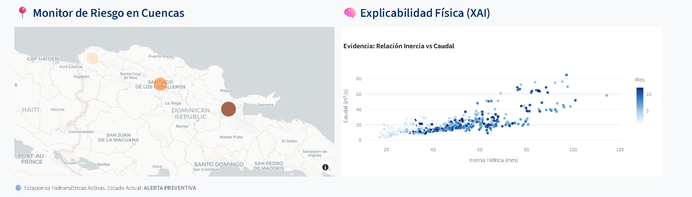
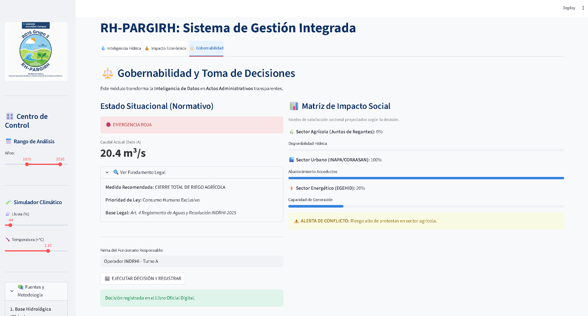
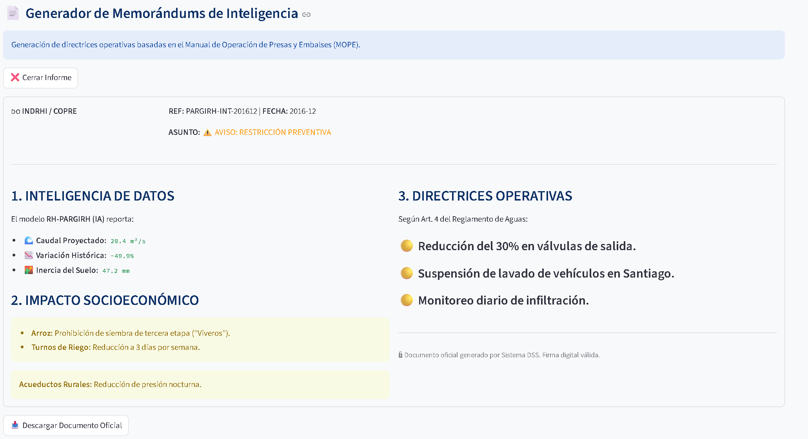
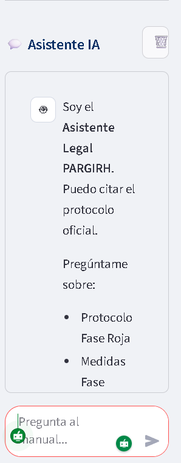

# 💧 RH-PARGIRH: Sistema de Inteligencia Hídrica y Gobernabilidad

<p align="center">
  
</p>


> **Proyecto Agricultura Resiliente y Gestión Integrada de Recursos Hídricos**
> *Transformando datos climáticos en decisiones justas y transparentes.*
 


🔗 VER DEMO EN VIVO AHORA

## 📖 Descripción General

**RH-PARGIRH Core** es un Sistema de Soporte a la Decisión (DSS) diseñado para mitigar la crisis de confianza en la gestión del agua en la República Dominicana.

Ante la variabilidad climática, este sistema no solo predice caudales; **cuantifica el impacto económico** de las sequías y **automatiza las decisiones administrativas** basándose en la normativa vigente (MOPE), garantizando transparencia y gobernabilidad.

### 🎯 El Problema
La gestión del agua suele ser una "caja negra". Los sectores productivos (agricultura, energía, consumo humano) compiten por el recurso, y la falta de datos claros genera desconfianza, conflictos sociales y pérdidas económicas millonarias.

### 💡 La Solución
Una plataforma unificada que ofrece:
1.  **Evidencia Científica:** Análisis hidrológico robusto.
2.  **Traducción Económica:** Conversión de mm de lluvia a RD$ de pérdidas.
3.  **Tecnocracia Auditorable:** Reglas claras y registros inmutables de decisión.

---

## 🚀 Módulos del Sistema

El sistema opera bajo una arquitectura modular de tres pestañas integradas:

### 1. 💧 Inteligencia Hídrica (Hydrology Core)
* **Monitor de Caudales:** Visualización histórica y proyecciones basadas en IA (Random Forest).
* **Simulador Climático:** Permite estresar el modelo ajustando variables de precipitación (%) y temperatura (+°C) en tiempo real.
* **Alertas Tempranas:** Detección de meses críticos basada en umbrales de seguridad.

### 2. 💰 Impacto Económico (FAO 33 Model)
* **Motor Paramétrico:** Implementación de la metodología *Yield Response to Water* (FAO No. 33).
* **Cálculo de Pérdidas (DOP):** Estimación monetaria del daño en cultivos clave (Arroz, Banano, Aguacate).
* **Calibración Dinámica:** Sliders para ajustar costos de producción por hectárea según la realidad del mercado actual.

### 3. ⚖️ Gobernabilidad y Decisión (Governance Engine)
* **Motor Híbrido:** Cruza los datos técnicos con el **Manual de Operación de Presas (MOPE)**.
* **Semáforo Normativo:** Indica automáticamente si se debe declarar "Alerta", "Emergencia" o "Normalidad".
* **Notario Digital (Audit Log):** Registro inmutable de cada decisión tomada por el operador, garantizando trazabilidad y transparencia institucional.
* **Matriz de Empatía:** Visualización del impacto social para facilitar la negociación entre sectores.

---

## 🛠️ Instalación y Uso

Sigue estos pasos para ejecutar el sistema en tu entorno local:

1.  **Clonar el repositorio:**
    ```bash
    git clone [https://github.com/tu-usuario/RH-PARGIRH-CORE.git](https://github.com/tu-usuario/RH-PARGIRH-CORE.git)
    cd RH-PARGIRH-CORE
    ```

2.  **Instalar dependencias:**
    ```bash
    pip install -r requirements.txt
    ```

3.  **Ejecutar la aplicación:**
    ```bash
    streamlit run app.py
    ```

---

## 📂 Estructura del Proyecto

```text
RH-PARGIRH-CORE/
├── app.py                  # Orquestador Principal (Main)
├── data/                   # Fuente de datos (CSVs)
├── modules/                # Arquitectura Modular
│   ├── data_loader.py      # Ingesta de datos
│   ├── engine.py           # Motor de cálculo hidrológico
│   ├── dashboard.py        # Visualización (Plotly/Mapas)
│   ├── economics.py        # Módulo Económico (NUEVO)
│   ├── governance.py       # Módulo de Gobernabilidad (NUEVO)
│   └── sidebar.py          # Configuración de usuario
└── assets/                 # Imágenes y logos
```
---

## 📸 Capturas de Pantalla

### 💧 1. Inteligencia Hídrica y Monitor de Riesgos
*Visualización en tiempo real de caudales, predicciones de IA y alertas territoriales.*

<p align="center">
  
  
</p>

### 💰 2. Impacto Económico (Modelo FAO 33)
*Estimación de pérdidas monetarias y calibración de costos agrícolas.*


### ⚖️ 3. Gobernabilidad y Reportes
*Toma de decisiones automatizada basada en el MOPE y generación de documentos oficiales.*

<p align="center">
  
  
</p>

### 🤖 Asistente Legal
*Chatbot integrado para consultas regulatorias.*



🤝 Créditos
Desarrollado por el equipo RD15 - SIC para el Samsung Innovation Campus Hackathon 2025.

Líder de Proyecto: Jeremy Bourdier Estrella

Científicos de Datos: Wandrys Ferrand Guzman

Desarrolladores: Jeremy Bourdier Estrella, Wandrys Ferrand Guzman

Scrum Master, Sopoerte auxiliar: Johán Manuel Vicente Berroa


Documentador Técnico, investigador: Randolf Valdimir Martinez Beltre


